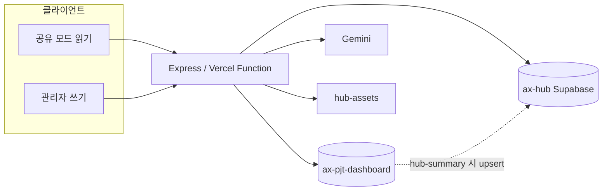

# AX Hub 개발 계획서 (As-Built)

기준: 현재 코드 (`Express + public/ + Supabase + Vercel`). 날짜: 2026-08-11.

## 1. 목표

AX 컨설팅 산출물을 **한 화면에서 현황 파악 + 지식 축적**한다.

1. 홈은 ax-pjt-dashboard의 협력사·참여자·과제 현황을 그대로 보여 준다.
2. 과제·프롬프트·Vibe 문서·Best Practice를 STATIK 기준으로 재사용 가능하게 저장한다.
3. 공유 URL은 읽기 전용, 관리는 비밀번호 토큰으로만 연다.
4. Best Practice는 스캔/문서(PDF·PNG)를 올리면 AI가 요약·분류·태그를 채운다.

비목표: 대시보드 원천 데이터의 편집 UI, 회원가입/OAuth, 실시간 협업, 모바일 네이티브 앱.

## 2. 범위 (구현됨)

| 영역 | 포함 | 제외 |
|------|------|------|
| 홈 | KPI 4종, 과제 요약 정렬, 정체 리스크, 현황 동기화, Library 이관 | 주간보고 편집 |
| 과제 Library | 수동 등록, 이관, STATIK, KPI, As-Is/To-Be 단계 | 대시보드 과제 수정 |
| 프롬프트 | 본문·TXT·변수 자동 추출·STATIK 필터 | 버전 히스토리 |
| Vibe | 5개 문서 탭, TXT 업로드, STATIK | 마크다운 렌더러 |
| Best Practice | PDF/PNG 분석, 개조식, 분야 11택일, 태그 5, 상세 수정·삭제, 원본 뷰어 | 사용자 분야 선택, published/draft UI |
| 운영 | Supabase RLS, Vercel, Gemini 키 UI 저장 | 프론트 DB 직접 접근 |

## 3. 아키텍처 결정

| 결정 | 이유 |
|------|------|
| 정적 UI + Express API | 단일 프로세스, Vercel Other 프리셋으로 배포 |
| Dual Supabase | 홈은 대시보드 원본을 읽고, 지식은 hub에 쌓아 결합도 분리 |
| `GET /api/hub-summary`에서 미러 upsert | 「과제 현황 업데이트」한 번에 조회+hub 동기화 |
| service_role은 서버만 | RLS 켠 `hub_*`에 anon 정책 없음 |
| HMAC 관리자 토큰 (12시간) | Auth 제품 없이 공유/관리 분리 |
| Gemini Flash-Lite + 폴백 | 비용 우선, 모델 ID 404 대비 |
| Storage `hub-assets` private | Vercel 에페메럴 FS에 파일 두지 않음 |

## 4. 모듈 맵

| 파일 | 책임 |
|------|------|
| `backend/src/app.js` | Express 팩토리, static `public/`, 에러 핸들러 |
| `backend/src/server.js` | 로컬 listen `127.0.0.1:3090` |
| `api/index.js` | Vercel 핸들러 |
| `routes.js` | REST, multer 15MB |
| `hub-summary.js` | 대시보드 KPI·과제·리스크 |
| `dashboard-sync.js` | 소스 → hub 미러 |
| `task-assets.js` / `prompts.js` / `vibe-docs.js` / `cases.js` | 라이브러리 |
| `gemini-client.js` | 모델 폴백 |
| `auth.js` | 토큰 발급·검증 |
| `public/js/app.js` | SPA 뷰·권한 UI |

## 5. 데이터 모델

### 5.1 Library (`SUPABASE_*`)

- `hub_task_assets` — 이관/수동 과제. `extras`에 STATIK, KPI, 단계, 담당자.
- `hub_prompts` — 템플릿, 변수, tags, statik, source_filename.
- `hub_vibe_docs` — `readme`, `plan_doc`, `ux_scenario`, `ui_design`, `other_doc`, `source_files`.
- `hub_cases` — 제목, 개조식 본문, before/after, outcome, tags, category, pdf_path/filename, gemini_raw. 상태는 DB에 draft/published가 있으나 UI는 구분하지 않고 분석 직후 published.
- `hub_settings` — Gemini API 키·모델.

모든 `hub_*` RLS ON, anon 정책 없음.

### 5.2 대시보드 소스 (`DASHBOARD_SUPABASE_*`)

`companies`, `participants`, `tasks`, `app_meta`, `task_weekly_reports`. hub에도 동일 스키마를 두고 미러한다. 홈 조회는 소스가 있으면 소스를 읽는다.

### 5.3 Best Practice 분류·태그

분야 택일: 기획, 개발, 마케팅, 영업, 구매, 제조, 품질, 물류, 서비스, 재무/경리, 인사/총무. 목록 밖·「일반」 금지. 서버가 alias를 정규화한다.

태그: Gemini가 핵심 키워드 **정확히 5개**. 부족하면 제목/본문 토큰으로 보완. 목록에는 분야·태그만 표시(파일 형식 숨김).

## 6. API

| 메서드 | 경로 | 인증 |
|--------|------|------|
| GET | `/api/health` | 없음 |
| GET | `/api/hub-summary` | 없음 (동기화 포함) |
| POST | `/api/auth/admin` | 비밀번호 |
| GET/POST/PATCH/DELETE | `/api/task-assets` | 쓰기만 관리자 |
| POST | `/api/task-assets/import` | 관리자 |
| GET/POST/PATCH/DELETE | `/api/prompts`, `/from-txt` | 쓰기만 관리자 |
| GET/POST/PATCH/DELETE | `/api/vibe-docs`, `/from-txt` | 쓰기만 관리자 |
| GET | `/api/cases`, `/cases/:id`, `/cases/:id/pdf` | 없음 |
| POST | `/api/cases/analyze` | 관리자, multipart `pdf` |
| POST/PATCH/DELETE | `/api/cases` | 관리자 |
| GET/POST | `/api/gemini/status`, `/gemini/key` | 키 저장은 관리자 |

업로드 MIME: 프롬프트/Vibe `.txt`, 사례 `application/pdf` · `image/png`.

## 7. AI 분석 파이프라인

1. 관리자가 PDF/PNG 선택 → `POST /api/cases/analyze`.
2. Gemini JSON: title, 개조식 mainContent/before/after/improvementEffect, category, tags[5].
3. 본문은 `- ` 항목, 서술형 금지.
4. Storage 업로드 실패 시 로컬 `uploads/` 폴백(Vercel에서는 비지속).
5. 상세에서 관리자가 필드·태그 수정 가능. 제목만 바꿔도 태그는 유지.

모델: `GEMINI_MODEL` 또는 `gemini-3.5-flash-lite` → `gemini-flash-lite-latest` → `gemini-2.5-flash-lite` → `gemini-2.5-flash`.

## 8. 보안·운영

- 프론트에 service_role 금지.
- 관리자 토큰 `localStorage` (`axHubAdminToken`), Authorization Bearer.
- 공유 모드: `.admin-only` 숨김, 상세 폼 읽기 전용, 「과제 현황 업데이트」 없음.
- Vercel `maxDuration` 300초, region `sin1`, `includeFiles` `backend/**` `public/**`.
- 홈 로딩 전 `ACCESS_PASSWORD`(기본 `ax2026h2`) 접근 게이트. API는 `/health`, `/auth/access` 외 접근 토큰 필요.
- 스키마 변경은 `supabase/migrations` + `npm run db:migrate`.

## 9. 일정 (완료 기준)

| 단계 | 산출 |
|------|------|
| 1. 셸·홈 | SPA, hub-summary, 공유/관리 |
| 2. 과제 Library | 이관, STATIK, KPI, 프로세스 |
| 3. 프롬프트·Vibe | 목록/상세, TXT, 5문서 탭 |
| 4. Best Practice | PDF 분석, Storage, 개조식 |
| 5. Dual DB·배포 | DASHBOARD_SUPABASE_*, Vercel, RLS |
| 6. 문서 UX 다듬기 | PNG, 분야 택일, 태그 5, 목록에서 파일형식 제거, 상세 수정 |

## 10. 후속 (미구현)

- 기존 Best Practice 일괄 재분석(구 태그/분야 마이그레이션)
- Gemini 키 등록 버튼을 공유 모드에서 숨김(현재는 보이지만 저장은 관리자만)
- 대용량 PDF 타임아웃 분할
- 마크다운 미리보기, 권한 역할 세분화
